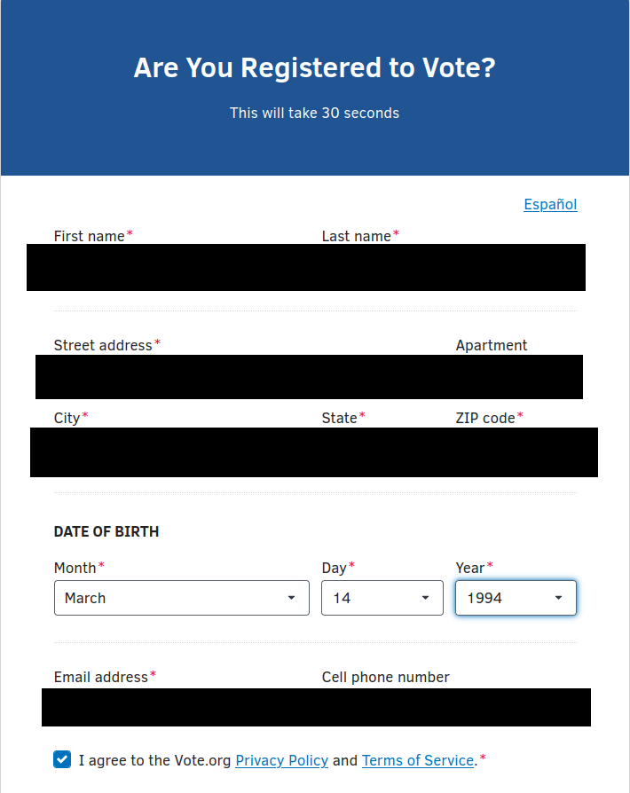
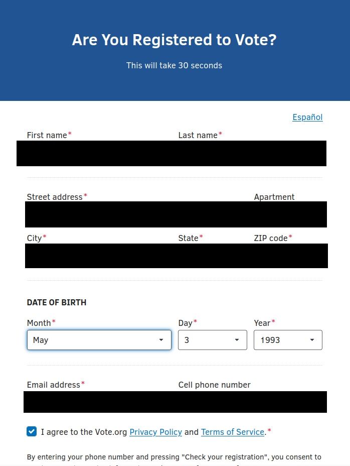

# Main repo for tapermonkey scripts for simple OSINT.

## Universal Background Check Exporter

Export results from multiple background check sites: FastBackgroundCheck, FastPeopleSearch, and ZabaSearch

Can only do one page each, comes with hyperlinks.

## Save as

- JSON
- Text

Also has the option to check ones voter status thoughout the states (less advanced, can't check political demographic).

## How to use:
- Install tapermonkey/greasemonkey
- copy paste this script
- ???
- profit

## Voter extraction (lite)

The voter extraction tool that is linked here is pretty lite, it isn't accurate with the mm-dd but it is accurate with the year. It is only accurate with the first-lastname, street, city, state and zipcodes. You also cannot get voter demographics such as what party this person belongs to.

---

## Voter reg status: Tapermonkey edition

Due to chrome driver being blocked, this would probably be the better solution!

## CSV file input example:

    zip,firstname,lastname,MM/DD/YYYY

and even for continuous days of that month.

    zip,firstname,lastname,MM/00/YYYY

Feel free to input the values, you can repeat this; will need to run in private mode (mobile); also can delete cookies in dev mode (desktop).

## Firefox

Right click inspect element > storage > cookies > https://www.pavoterservices.pa.gov > Delete all session cookies

## Chrome

Right click inspect element > storage > cookies > https://www.pavoterservices.pa.gov > clear

Use this when dealing with a CAPTCHA, how would you know? if the error sign isn't showing up.

## Example output

    firstName,lastName,dob,zip,county,status,result,timestamp
    "firstname","lastname","MM/DD/YYYY","zip","county","found","YOUR RESIDENTIAL ADDRESS
    zip  address
    YOUR MAILING ADDRESS

    Is your information up to date?
    If you need to update your voter registration, please visit
    vote.pa.gov/Register and submit an online voter registration application.
    VOTER RECORD DETAILS

    Status:
    ACTIVE
    Date of Birth:
    mm/dd/yyyy
    Party:
    DEMOCRATIC
    Are you an annual mail-in or absentee voter?
    NO
    Do you have an approved mail ballot request for the upcoming election?
    NO
    VOTING DISTRICTS

    County:
    ERIE
    Precinct:
    MILLCREEK TOWNSHIP 6TH DISTRICT
    Municipality:
    MILLCREEK TOWNSHIP
    United States Congress:
    16TH CONGRESSIONAL DISTRICT
    State Senate:
    49TH SENATORIAL DISTRICT
    State House:
    3RD LEGISLATIVE DISTRICT
    COUNTY BOARD OF ELECTIONS

    140 W 6TH ST RM 112 ERIE, PA 16501
    Phone:
    (814) 451-6275
    Email:
    TFERNANDEZ@ERIECOUNTYPA.GOV
    If you have any questions about your voter record or voting districts, you may find county election office contact information at
    www.vote.pa.gov/county
    YOUR ELECTION DAY POLLING PLACE

    Polling Place for MILLCREEK TOWNSHIP 6TH DISTRICT
    place
    address
    ERIE,
    PA
    zip
    State:
    Zip Code:","2025-10-24T14:06:01.376Z"
    

1. Get taper monkey https://www.tampermonkey.net/ or greasemonkey (mobile).
2.  Install this script (copy paste)
3.  profit?

---

## Breach.VIP and reddit profile analyzer

Search breach data and analyze Reddit users

## Breach data search

Find results via:

* Email
* username
* phone number
* full name

## R00M101

* Input reddit username (even deleted).

---

TO DO:

Make the GUI look more clean perhaps?

---

**Voter info results with vote.org**

---

